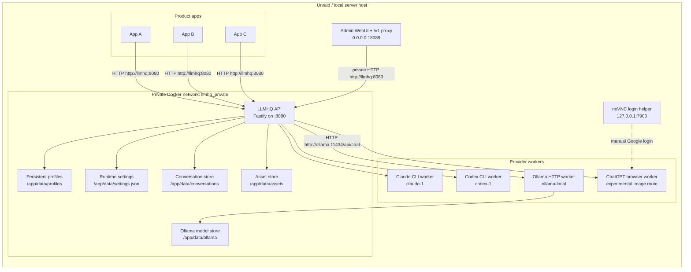
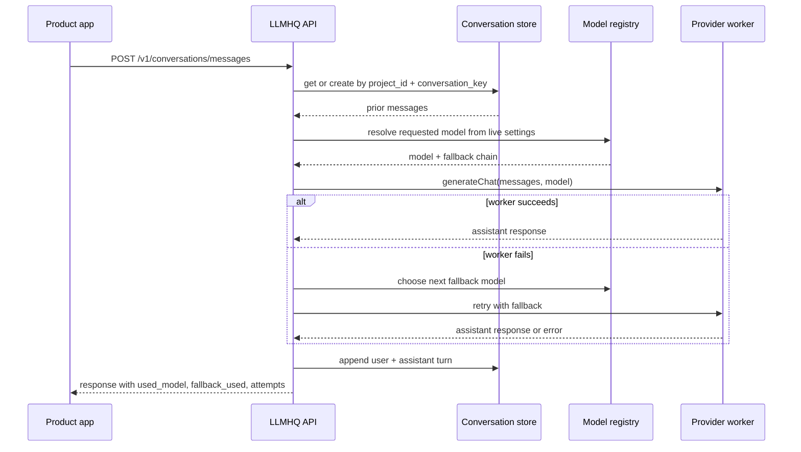
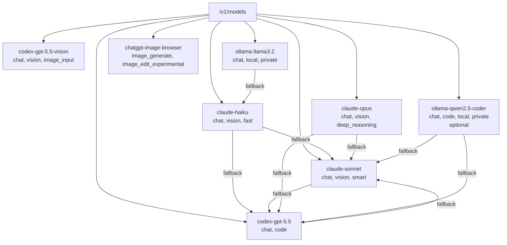

# LLMHQ Technical Architecture

## Purpose

LLMHQ is a private, same-server LLM gateway. Product apps call one local API instead of each app installing and managing separate Claude, Codex, ChatGPT, credentials, and wrapper code.

The current implementation is a Fastify API container with persistent provider profiles, editable runtime settings, model aliases, explicit fallback, file-backed conversations, local asset storage, an admin WebUI, a local Ollama sidecar, and an experimental ChatGPT browser worker for image generation.

## Deployment Topology



## Request Flow



## Model Registry



Apps select the model explicitly. Codex text/code, Codex vision input, Ollama local text, and ChatGPT image output are separate aliases in the runtime settings catalog even when aliases share a provider account or endpoint. If a selected model fails, LLMHQ reports the failure in `attempts` and then uses the configured default fallback unless the request disables fallback with `fallback: "none"` or `fallback: false`.

Runtime model settings are stored in `LLMHQ_SETTINGS_FILE`, defaulting to `./data/settings.json`. The admin WebUI can edit:

- default chat model
- Claude and Codex worker profile directories
- Ollama worker base URLs
- model aliases
- provider-native CLI model names
- model capabilities metadata
- model output modality metadata
- default fallback chains

Saving settings validates the JSON, writes it to disk, rebuilds the in-memory registry, and applies the new routing behavior to subsequent calls without restarting LLMHQ.

Provider usability is separate from provider configuration. The admin provider probe sends a minimal chat request per provider so LLMHQ can show whether the CLI profile can actually answer. If a worker fails with sticky provider state such as `auth_required`, LLMHQ marks that worker unavailable for a short cooldown and skips other aliases using the same worker while trying fallback providers.

## API Surface

| Endpoint | Purpose |
| --- | --- |
| `GET /health` | Gateway and provider health. |
| `GET /admin` | Admin WebUI. |
| `/v1/*` on WebUI port `18089` | Proxy to the internal API for deliberate LAN validation callers. |
| `GET /admin/settings` | Live runtime settings and rebuilt model list. |
| `PUT /admin/settings` | Validate, persist, and apply runtime settings. |
| `POST /admin/settings/reload` | Reload settings from disk and rebuild the registry. |
| `POST /admin/provider-probe` | Verify provider sessions with minimal real requests. |
| `GET /v1/models` | Model aliases, capabilities, outputs, and fallback chains. |
| `POST /v1/chat/completions` | Stateless OpenAI-style chat call. |
| `POST /v1/conversations` | Create or resolve a project conversation. |
| `GET /v1/conversations?project_id=...` | List conversations, optionally by project. |
| `GET /v1/conversations/:conversationId` | Read one stored conversation. |
| `POST /v1/conversations/:conversationId/messages` | Continue a stored conversation by id. |
| `POST /v1/conversations/messages` | Continue a stored conversation by `project_id + conversation_key`. |
| `POST /v1/images/generations` | Generate an image through the experimental ChatGPT browser worker. |
| `GET /v1/assets/:assetId` | Serve generated local assets. |

## Stateful Conversation Layer

The preferred stateful integration uses:

- `project_id`: stable app or product identifier, for example `soundpulse`.
- `conversation_key`: stable workflow identifier, for example `strategy-generator`.
- `default_model`: optional default model for that conversation.
- `message`: one new user message or a small batch of new messages.
- `context`: optional generic app context with `summary`, `metadata`, and `messages`.

LLMHQ stores history centrally and replays app context plus the last `LLMHQ_MAX_CONVERSATION_MESSAGES` chat messages when generating the next turn. App context is deliberately generic: LLMHQ does not know whether the caller is a coding app, catalog app, music app, or another workflow. It simply stores and prepends the application-provided context block.

## Auth And Network Boundary

The current same-server configuration uses:

```env
LLMHQ_AUTH_MODE=none
```

That is acceptable only when LLMHQ is bound to `127.0.0.1` and/or available only on a private Docker network. If LLMHQ is exposed beyond the local host or private Docker network, enable bearer keys with `LLMHQ_API_KEYS`.

Default app URLs:

- Product containers on the same Unraid server: `http://llmhq:8080`
- Host-native apps on the Unraid server: `http://127.0.0.1:18088`
- Browser/admin access from LAN: `http://<server-ip>:18089/admin`
- Desktop validation callers that need the Unraid API from LAN: `http://<server-ip>:18089`

## Provider Profiles

Persistent provider state lives under `./data` on the host and is mounted into the container:

| Provider | Profile path |
| --- | --- |
| Claude | `/app/data/profiles/claude-1` |
| Codex | `/app/data/profiles/codex-1` |
| Ollama | `/app/data/ollama` for model files, worker endpoint `http://ollama:11434` |
| ChatGPT browser | `/app/data/browser-profiles/chatgpt-main` |

These profiles hold CLI/browser login state. LLMHQ does not store Google passwords.

## Operational Constraints

- Claude and Codex depend on official CLI login state. If a provider logs out, that provider fails and LLMHQ reports it.
- Ollama does not need external login, but selected native models must be pulled into the `llmhq-ollama` model store before the corresponding LLMHQ alias can answer.
- The ChatGPT image worker is experimental because it automates the ChatGPT web UI. UI changes, captcha, rate limits, or logout can break it.
- The API reports the actual `used_model`, `used_worker`, `fallback_used`, `fallback_reason`, and `attempts` so product apps can surface provider failures instead of hiding them.
- Same-server latency is mostly local HTTP overhead plus provider execution time. It avoids reinstalling provider CLIs in every product app.
